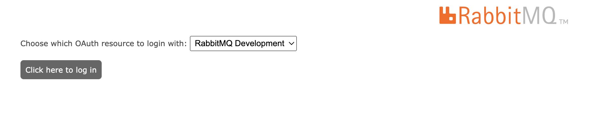

# Use multiple OAuth2 servers

You are going to test the following OAuth flows:
1. Access AMQP protocol
2. Access Management UI

**NOTE** : This use case deploys a RabbitMQ docker image built from a PR which is still in progress.
The docker image is **pivotalrabbitmq/rabbitmq:oauth-multi-resource-support-otp-max-bazel**

## Prerequisites to follow this guide

- Docker

## Motivation

All the examples and use-cases demonstrated by this tutorial, except for this use case, configure a single **resource_server_id** and therefore a single **OAuth 2.0 server**.

However, you could encounter scenarios where some management users and/or applications are registered in
different OAuth2 servers or they could be registered on the same OAuth2 server however they could refer to RabbitMQ with different audience values. When this happens, you have to declare two OAuth2 resources in RabbitMQ, one for each audience.

The following section demonstrates an scenario where users are declared in **Keycloak** however they refer to RabbitMQ with two distinct **audience**, one `rabbit_prod` and the other `rabbit_dev`.

## AMQP clients and management users registered in same OAuth 2.0 server but with different audience

RabbitMQ is configured with two OAuth2 resources one called `rabbit_prod` and another `rabbit_dev`. Think that the
production team refers to RabbitMQ with the `rabbit_prod` audience. And the development team with the `rabbit_dev` audience.
Because both teams are registered in the same OAuth2 server you are going to configure its settings such as `jwks_url` at the
root level so that both resources share the same configuration.

In the past, RabbitMQ imposed a restriction where the scopes had to be prefixed with the name of the resource/audience. For instance, if `resource_server_id` was `rabbitmq1`, all scopes had to be prefixed with the value `rabbitmq1` e.g. `rabbitmq1.tag:administrator`.

Since RabbitMq 3.11 and 3.12, this restriction and you can configure the scope's prefix independent from the resource_id/audience. This is exactly what this scenario uses which configures the scope prefix with the value `rabbitmq.` so that all scopes, regardless of the resource, have the same prefix.


### Test applications accessing AMQP protocol with their own audience

The setup: (This is the [rabbitmq.conf](../conf/multi-keycloak/rabbitmq.conf) used on this setup)
- There are two OAuth2 clients (`prod_producer` and `dev_producer`) declared in keycloak and configured to access their respective audience: `rabbit_prod` and `rabbit_dev`
- RabbitMQ OAuth2 plugin has been configured with 2 resources: `rabbit_prod` and `rabbit_dev`
	```
	auth_oauth2.resource_servers.1.id = rabbit_prod
	auth_oauth2.resource_servers.2.id = rabbit_dev
	```
- Also RabbitMQ OAuth2 plugin has been configured with common settings for the two resources declared above
	```
	auth_oauth2.preferred_username_claims.1 = preferred_username
	auth_oauth2.preferred_username_claims.2 = user_name
	auth_oauth2.preferred_username_claims.3 = email
	auth_oauth2.jwks_url = https://keycloak:8443/realms/test/protocol/openid-connect/certs
	auth_oauth2.scope_prefix = rabbitmq.
	auth_oauth2.https.peer_verification = verify_peer
	auth_oauth2.https.cacertfile = /etc/rabbitmq/keycloak-cacert.pem
	```

Follow these steps to deploy Keycloak and RabbitMQ:

1. Launch Keycloak (http://localhost:8081/admin/master/console/#/test)
```
make start-keycloak
```
2. Launch RabbitMQ
```
export MODE="multi-keycloak"
make start-rabbitmq
```

3. Launch AMQP producer registered in Keycloak with the **client_id** `prod_producer` and with the permission to access `rabbit_prod` resource and with the scopes `rabbitmq.read:*/* rabbitmq.write:*/* rabbitmq.configure:*/*`:

```
make start-perftest-producer-with-token PRODUCER=prod_producer TOKEN=$(bin/keycloak/token prod_producer PdLHb1w8RH1oD5bpppgy8OF9G6QeRpL9)
```

This is an access token generated for `prod_producer`. The relevant attribute is `"aud": "rabbit_prod"`
```
{
  "exp": 1690974839,
  "iat": 1690974539,
  "jti": "c8edec50-5f29-4bd0-b25b-d7a46dc3474e",
  "iss": "http://localhost:8081/realms/test",
  "aud": "rabbit_prod",
  "sub": "826065e7-bb58-4b65-bbf7-8982d6cca6c8",
  "typ": "Bearer",
  "azp": "prod_producer",
  "acr": "1",
  "realm_access": {
    "roles": [
      "default-roles-test",
      "offline_access",
      "producer",
      "uma_authorization"
    ]
  },
  "resource_access": {
    "account": {
      "roles": [
        "manage-account",
        "manage-account-links",
        "view-profile"
      ]
    }
  },
  "scope": "profile email rabbitmq.read:*/* rabbitmq.write:*/* rabbitmq.configure:*/*",
  "clientId": "prod_producer",
  "clientHost": "172.18.0.1",
  "email_verified": false,
  "preferred_username": "service-account-prod_producer",
  "clientAddress": "172.18.0.1"
}
```

4. Similarly, launch AMQP producer `dev_producer`, registered in Keycloak too but with the permission to access `rabbit_dev` resource:
```
make start-perftest-producer-with-token PRODUCER=dev_producer TOKEN=$(bin/keycloak/token dev_producer z1PNm47wfWyulTnAaDOf1AggTy3MxX2H)
```


### Test Management UI accessed via two separate resources

The setup:
- There are two users declared in Keycloak: `prod_user` and `dev_user`
- The two resources, `rabbit_prod` and `rabbit_dev`, are declared in the Rabbitmq management plugin with their own OAuth2 client (`rabbit_prod_mgt_ui` and `rabbit_dev_mgt_ui`), scopes and the label associated to each resource.
	```
	management.oauth_resource_servers.1.id = rabbit_prod
	management.oauth_resource_servers.1.client_id = rabbit_prod_mgt_ui
	management.oauth_resource_servers.1.label = RabbitMQ Production
	management.oauth_resource_servers.1.scopes = openid profile rabbitmq.tag:administrator

	management.oauth_resource_servers.2.id = rabbit_dev
	management.oauth_resource_servers.2.client_id = rabbit_dev_mgt_ui
	management.oauth_resource_servers.2.label = RabbitMQ Development
	management.oauth_resource_servers.2.scopes = openid profile rabbitmq.tag:management
	```
- Because there is only one OAuth2 server, both resources share the same `provider_url`:
	```
	management.oauth_provider_url = http://0.0.0.0:8081/realms/test
	```
- Each OAuth2 client, `rabbit_prod_mgt_ui` and `rabbit_dev_mgt_ui`, has been declared in Keycloak so that they can only emit tokens for their respective audience, be it `rabbit_prod` and `rabbit_dev` respectively.

1. Go to [Management ui](http://localhost:15672)
2. Select `RabbitMQ Production` resource

	

3. Login as `prod_user`:`prod_user`
4. Keycloak prompts you to authorize various scopes for `prod_user`
5. You should now get redirected to the Management UI as `prod_user` user

Now, logout and repeat the same steps for `dev_user` user. For this user, RabbitMQ has been configured to request only `rabbitmq.tag:management` scope.

**Note**: If on step 3, you login as `dev_user`, RabbitMQ will not authorize the user because RabbitMQ has been configured to request the scope `rabbitmq.tag:administrator` for `RabbitMQ Production` however the `dev_user` does not have that scope, but `rabbitmq.tag:management`. Therefore, the user gets a token which has none of the scopes RabbitMQ supports.
